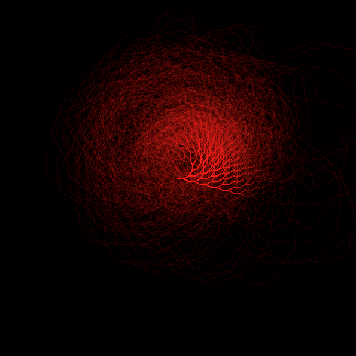

# What are we going to do? 

Procedurally generated art has been around for a long time - at it's core it is about defining algorithms which produce some of kind of artwork. For the most part this consists of graphics but could include sound or other mediums too. In this workshop we'll learn the basics of a Javascript library called p5js as build simple yet beautiful graphics. 

As you go through this workshop, you will be introduced to more and more functions and it can all get a little hard to remember. Never fear, the [p5js reference](https://p5js.org/reference/) is here. It describes all of the functions, their arguments and even gives examples of them being used. 

It would also be disrespectful if I didn't mention [Daniel Shiffman](https://twitter.com/shiffman) and the work he has been doing on [The Coding Train](https://www.youtube.com/thecodingtrain) from which this workshop takes inspiration. 

# The basics 

p5js is a Javascript library exposing some functions to build graphics. There are two "phases" to drawing something on your screen - an initial `setup` and then the `draw` loop. The setup is called once at the beginning of the session and here you can create the canvas your going to draw on and initialise any objects you want. The draw loop is then called continuously thereafter - there you put your actual graphics code. 

A simple example can be found in the `examples` folder under `typical_setup`. The actual p5 sketch looks like: 

```javascript
function setup() {}
function draw() {}
```

As described before, these are the two functions we need to start drawing things in the browser. When you open the p5 editor these will handily already be there for you. Our next goal is to get our canvas created and to draw a background colour. This can be achieved through the aptly named `createCanvas` and `background`. 

```javascript
function setup() {
  createCanvas(600, 600);
}

function draw() {
  background(255, 0, 0); /* Why in here and not in initial setup? */
}
```

Why do we draw the background colour in the draw loop and not in the initial setup? Because later on if we do some kind of animation we want to the screen to be "cleared" every loop pf the `draw` function. By placing `background(255, 0, 0)` at the top of the `draw` loop, every "frame" will start by clearing everything and rendering a red background (you can change this to any colour you want). 

Basic Shapes
------------

p5 comes with basic shape primitives that we can use to make some cool graphics the main ones include:

  - `rect(x, y, w, h)`
  - `ellipse(x, y, w, h)` 
  - `triangle(x1, y1, x2, y2, x3, y3)`

Let's draw circle on the screen! One important thing to remember when coding with p5 (and in general with graphics) is that a lot of things are managed by some global state like "what colour should I be drawing with now" or "whereabouts should I draw this" - it might take a bit to get your head around as we're more used to these states being linked to the objects. Let's make that clearer with an example.

```javascript
function setup() {
  // Canvas setup
  createCanvas(600, 600);
}

function draw() {
  // Draw a red background every frame
  background(255, 0, 0); 
  // Draw a circle centred at (0, 0)
  ellipse(0, 0, 10, 10);
}
```

You might be wondering - why is it up in the top left corner of the screen. Surely `(0, 0)` should be in the middle of the screen, or even in the bottom-left?! `(300, 300)` is actually in the middle of our screen. Yes, it's like the y-axis is inverted and the x axis has stayed the same with the origin being moved to the top left corner. There are two ways we can get the circle to move to the middle of the screen, the simplest is `ellipse(300, 300, 10, 10)`. Another way is to change the "whereabouts should I draw this" state I was talking about before. To do this we use the `translate(x, y)` function which moves our drawing point and sets it to the middle of the screen if we provide the right x and y coordinates. 

```javascript
function setup() {
  createCanvas(600, 600);
}

function draw() {
  background(255, 0, 0); 
  // Move our origin to the centre of the screen 
  translate(300, 300);
  ellipse(0, 0, 10, 10);
}
```

Remember the idea of global state? Whenever we call the `createCanvas` method it also sets the global variables `width` and `height`. We can use these to avoid *hard-coding values* into our program... a basic programming no-no. 

Notice how the x and y coordinates for the ellipse are still set to `0` we've just moved our origin to the centre of the screen. Just like we had this global state for where we draw, we can also set the colour in a similar fashion using `fill`, let's also add a rectangle to see the effects of this (for brevity I will only include the functions that change). We'll also set the background to white and instead of having to specify `R`, `G` and `B` since they are the same we only need to do it once. 

```javascript 
function draw() {
  background(255); 
  // Using the global variables
  translate(width/2, height/2);
  // Setting the colour to blue
  fill(0, 0, 255);
  ellipse(0, 0, 10, 10);
  rect(10, 0, 10, 10);
}
```

We now have a blue circle *and a blue square* beside each other. Since we set the global "where to draw" and a "colour to draw" state - both shapes are drawn with the same colour and positioned relative to the centre of the canvas. So if we wanted the square to be *green* we would have to call `fill(0, 255, 0)` in-between the call to `ellipse` and `rect`. 

# Pushing & Popping 

Hopefully you can see why it might be useful to use these transformations to move our origin around and then we can draw with the parameters set to `0`. It handles the more complex logic of having to calculate pixel values relative to each other. This is often how graphics performs transformations - for more intuition about this try [this online](http://math.hws.edu/graphicsbook/c2/s3.html) app. 

Sometimes we translate or rotate or perform any other transformation but want to return to where we before. These transformations can get quite complex. One way to do this is to do the transformations in reverse order with inverted arguments like the following example. 

```javascript
function draw() {
  background(220);
  translate(width/2, height/2);
  // PI is a global variable from p5\
  // Rotate needs radians not degrees by default
  rotate(PI/4);
  rect(0, 0, 100, 100);
  // Undoing the rotate
  rotate(-PI/4);
  // Undoing the translation
  translate(-width/2, -height/2);
  ellipse(0, 0, 100, 100);
}
```

That was tedious... no worries - that's what `push` and `pop` are for. These might seem oddly named but what they are referencing are *stacks*. Think of a stack of plates. Whatever plate you put on the stack last, is going to be the first that you take off again. You `pushed` the plate onto the stack and `popped` it off. Yet again I'm going to refer to all of that *global state*! Whenever we call the `push()`, p5 takes all of the global state and saves it onto a stack, when we then call the associated `pop()` it restores that state. Let's rewrite the previous example to see how it saves us writing even more code. 

```javascript
function draw() {
  background(220)
  // Before translating we want to save the state of the world
  push();
  translate(width/2, height/2);
  rotate(PI/4);
  rect(0, 0, 100, 100);
  // Undoing the transformations is easy now
  pop();
  ellipse(0, 0, 100, 100);
}
```

I have purposefully made the last example use a common mistake when working with graphics. The square we drew was not centred... why? Whenever we draw certain shapes (`rect` here) - the `x` and `y` we provide is not the centre of the shape, it is the top left corner. This is what we placed at the origin, this is also then our centre of rotation hence why these examples have the rectangle a little too low. We can correct this by translating more cleverly. 

```javascript
const squareSize = 100;
function draw() {
  background(220)
  translate(width/2 - squareSize/2, height/2 - squareSize/2);
  rotate(PI/4);
  rect(0, 0, 100, 100);
}
```

Hmmm, that didn't work... why? Well if we weren't rotating we would have a square that looks centred but the problem is the centre of rotation is in the top left corner. We want it to be the centre of the square. So we want to move to the middle, rotate then move a little back to centre the square. 

```javascript
const squareSize = 100;
function draw() {
  background(220)
  translate(width/2, height/2);
  rotate(PI/4);
  // This could be a possible solution 
  translate(-squareSize/2, -squareSize/2);
  rect(0, 0, squareSize, squareSize);
}
```

We can also change the mode by which we draw rectangles by calling `rectMode(RADIUS)` (as opposed to the the default `rectMode(CORNER)`) - note that the `width` and `height` arguments now become `radius` arguments so to get the same shape we need to half them. 

```javascript
function setup() {
  createCanvas(600, 600);
  // Setting the mode for rectangles
  rectMode(RADIUS);
}

const squareSize = 100;
function draw() {
  background(220)
  translate(width/2, height/2);
  rotate(PI/4);
  rect(0, 0, squareSize/2, squareSize/2);
}
```

# Making Art 

We've covered a lot of the basics that now let's us start building some beautiful bits of art. In this first example, we'll take it somewhat slowly and draw a grid that slowly changes colour from the top corner to the bottom corner. 

First things first, let's initialise some of the things we want. Whenever you build a sketch one key mantra is *parameterise all the things*. This makes it a lot easier to explore and be more creative by (a) changing the parameters and (b) dynamically changing them. 


```javascript
// How many rows and columns we want in the grid
const G_WIDTH  = 20;
const G_HEIGHT = 20;
// To be calculated...
let cellWidth, cellHeight;

// Called at the beginning once
function setup() {
  createCanvas(600, 600);
  // Calculate cell size - canvas dimensions divided by how many
  // cells we want per column and row
  cellWidth = width / G_WIDTH;
  cellHeight = height / G_HEIGHT;
}

function draw() {
  background(244);
}
```

Hopefully a lot of that is fairly straight forward. By parameterising the values we can easily increase or decrease the number of cells we draw by changing two numbers. For ease of reading, I will only include the minimum changes for each code block as before. 

So now we want to draw our grid. This is essentially a rectangle for every cell in the grid. One for each of the `G_WIDTH * G_HEIGHT` cells we have. To iterate over all of these we will use a for-loop. 


```javascript 
function draw() {
  background(244);

  // iterate over the cells
  for (let row = 0; row < G_HEIGHT; row++) {
    for (let col = 0; col < G_WIDTH; col++) {
      // Draw the cell 
    }
  }
}
```

The naming conventions I'm using here should help indicate what each of the loop variables are counting. Now we need to use these variables to calculate where to draw our rectangles. We know what size they will be so it will look something like `rect(x, y, cellWidth, cellHeight)`. But what are `x` and `y`?

Well each cell is indexed by `col` and `row` but these are counting in `1`s. We want them to really count in `cellWidth` and `cellHeight`. If I draw a cell of size `(10, 10)` at `(20, 10)` and then want to draw one next to it and below it I would have to draw them at `(20 + 10, 10)` and `(20, 10 + 10)`. We need to add the widths and the heights to get to the next spot! We can do this by changing what we increment by each iteration, then drawing a rectangle with that width and height at that point. 

We also need to change what the upper bounds on our loops are. This is simple, we just multiply by the cell size, or because we know that `height = G_HEIGHT * cellHeight` we can just reference these global variables. 

```javascript 
function draw() {
  background(244);

  // iterate over the cells
  for (let row = 0; row < height; row+=cellHeight) {
    for (let col = 0; col < width; col+=cellWidth) {
      rect(col, row, cellWidth, cellHeight);
    }
  }
}
```

Notice that to keep our loops counting in 1s we can just change the code inside the `rect` call. 

```javascript 
function draw() {
  background(244);

  // iterate over the cells
  for (let row = 0; row < G_HEIGHT; row++) {
    for (let col = 0; col < G_WIDTH; col++) {
      rect(col * cellWidth, row * cellHeight, cellWidth, cellHeight);
    }
  }
}
```

We have a grid! Now to do the fading colour. We want to start in the top left corner with black and make our way down to white in the bottom right corner. First, let's create a unique index for each cell in the grid. We can do this by enumerating them. Using `row` and `col` we're nearly there. The problem is `col` starts at `0` again for each `row`. If we have a `(20, 20)` grid we want the first cell in second row to be number `20` (with 0-based indexing). So for each row we just need to add a rows worth of cells. 

```javascript
// Indexing
idx = col + row * G_WIDTH; 
```

Great! Now comes a more tricky step. Colours use the numbers from `0` to `255` but with our indexing strategy we're using `0` to `400` (for a `20` by `20` grid). We need some way to map one number line to another... good thing this happens a lot and there's a p5 function for this! 

```javascript 
// map(point, old_lower, old_higher, new_lower, new_higher)
let color = map(idx, 0, G_HEIGHT * G_WIDTH, 0, 255);
```

And now we just call fill with the right colour. 

```javascript
const G_WIDTH  = 20;
const G_HEIGHT = 20;
// To be calculated...
let cellWidth, cellHeight;

// Called at the beginning once
function setup() {
  createCanvas(200, 200);
  // Calculate cell size - canvas dimensions divided by how many
  // cells we want per column and row
  cellWidth = width / G_WIDTH;
  cellHeight = height / G_HEIGHT;
}


function draw() {
  background(244);
  // iterate over the cells
  for (let row = 0; row < G_HEIGHT; row++) {
    for (let col = 0; col < G_WIDTH; col++) {
      let idx = col + row * G_WIDTH; 
      let color = map(idx, 0, G_HEIGHT * G_WIDTH, 0, 255);
      fill(color);
      rect(col * cellWidth, row * cellHeight, cellWidth, cellHeight);
    }
  }
}
```

# Recap

We've come a long way from knowing nothing about p5js at the start - let's take a moment to recap some of things we have learnt along the way: 

- Basic Shapes: `ellipse`, `rect` and `triangle` 
- Basic transformations: `translate` and `rotate` 
- Colours: `color(r, g, b)` 
- The idea of some global state, the setup and draw-loop 
- Pushing and popping saved state

In this last tutorial we're going to bring everything together. This is largely based on the Daniel Shiffman's great Coding in the Cabana [video](https://www.youtube.com/watch?v=EYLWxwo1Ed8). It does things a little differently but the principles are the same. 

# Collatz Conjecture 

The [Collatz Conjecture](https://en.wikipedia.org/wiki/Collatz_conjecture) is a long-standing mathematics problem, which at its heart is very simple to explain. Given some positive integer `n` do the following:

 - If `n` is even, divide it by `2`
 - If `n` is odd, multiply it by `3` and add `1`

If at some point `n` is equal to `1` then stop. The conjecture is that for all positive integers, eventually you will reach `1`. What we're interested in is the path a particular positive integer takes. By path I mean, for each step all the way to `1` did it do the first rule or the second rule. The function below calculates and saves the path. `LEFT` means `n/2` and `RIGHT` means `3n + 1`. 

```javascript
const LEFT = 1;
const RIGHT = -1;

function collatz(n, path) {
  // Return the paths we took 
  if (n == 1) {
    return path;
  }

  // If even then divide by two and turn right 
  if (n % 2 == 0) {
    let t = [...path, RIGHT];
    return collatz(n / 2, t);
  }

  // If odd, times by 3 add 1 (divide by two and do two steps in one)
  return collatz((3 * n + 1) / 2, [...path, LEFT, RIGHT]);
}
```

Now that we have our paths we want to actually do something creative with them. For this example, we're just going to draw the paths as line segments. The interesting part is that for each segment we're either going to rotate a little to the `LEFT` or a little to the `RIGHT`. First things first, let's move to the centre of our canvas and draw a line. 

```javascript

// PARAMETERISE ALL THE THINGS
const lineLength = 10;
const angle = 0.1;

function draw() {
  // Draw a background colour
  background(0);

  // Move the center 
  translate(width/2, height/2);
  

  // Draw a line 
  line(0, 0, lineLength, 0);
}
```

This should just draw a line out to the right starting at the centre of our canvas. Nothing special, but a good start. But we haven't calculated the paths! We only want to do this once, so it makes sense to put it in the `setup` function at the beginning. 

```javascript
const N = 10;
let collatzes = [];

// Called at the beginning once
function setup() {
  createCanvas(600, 600);

  // Generate the path of the collatzes at the start
  for (let i = 2; i < N; i++) {
    collatzes.push(collatz(i, []));
  }
}
```

We iterate over each of the integers from `1` to `N` and calculate the path using our function `collatz`. We then add this path to our lists of paths `collatzes`. We're almost there! Now comes the slightly more tricky bit. To draw a path of line segments, (1) we need to draw a line, (2) move to the end of the line and repeat. We also need to do our rotation and once we're done with a path we want to move back to where we started to be ready for the next path. Hopefully `push` and `pop` are springing to your mind when I said that. Let's look at the loop for doing this.

```javascript 
// Each cs is a path e.g. [LEFT, RIGHT, RIGHT, LEFT....]
for (let cz of collatzes) {
  // SAVE THE STATE SO WE CAN COME BACK
  push(); 
  // Iterate over the path 
  for (let i = 0; i < cz.length; i++) {
    // 1. Draw a line 
    // 2. Move to the end of the line 
    // 3. Rotate based on left or right 
  }
  // RETURN TO THE CENTRE 
  pop(); 
}
```

Maybe try filling in the comments with code that does what they say before looking at the answer in the final code block below with a full definition of the `draw` loop. Remember because of translations and rotations handle direction the `line` function should be static (the same). In fact so should the translation - the only real thing that changes for each path is the angle we turn. 


```javascript
function draw() {
  background(0);
  // Set the stroke to red and a small opacity
  stroke(255, 0, 0, 29);
  // To the center
  translate(width / 2, height / 2);

  for (let cs of collatzes) {
    // Save the state of the world 
    push();
    for (let i = 0; i < cs.length; i++) {
      // Draw a line outward
      line(0, 0, lineLength, 0);
      // Move to the end of the line
      translate(lineLength, 0);
      // Based on the collatz path rotate left or right
      rotate(cs[i] * angle);
    }
    // Pop the state i.e. move back to the center for the next round
    pop();
  }

  // This only needs to be drawn once, so we can turn off the loop
  noLoop();
}
```


